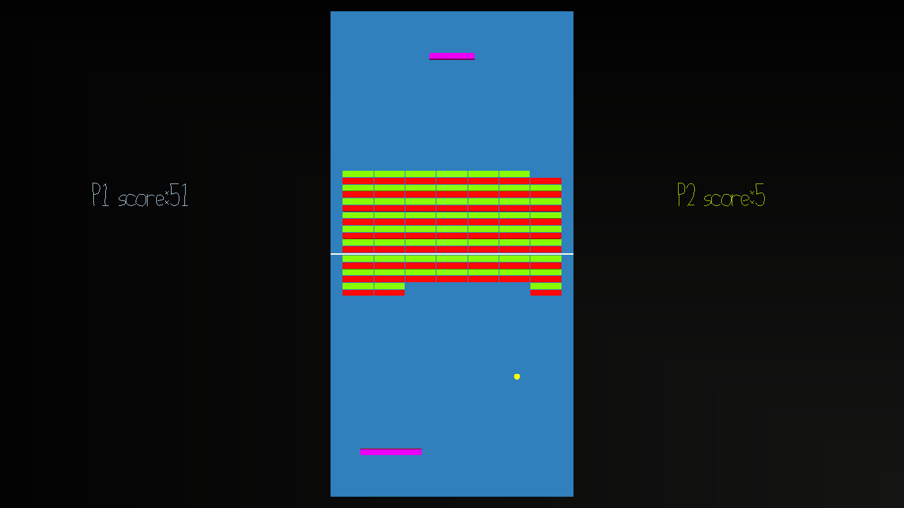

# Pong Breaker

Author: Rakshit Tikoo

Design: The game is a mash between the classic games, brick breaker and pong. Both players have their ball types (yellow for P1 and red for P2). Now both players can hit the bricks on the screen, and each brick hit counts towards a point. Yellow ball hits count as P1 points, and Red ball hits count as P2 hits. Now, the PONG part, if a player misses a ball, Yellow or Red, it counts as points for the opposing player. The game ends when there are no more balls on the play area. There are certain power ups that can make the gameplay more fun and challenging. 

Networking: Inspired by the spawn player code, a new function was made in Game.cpp, called assign_player, which checks if there are the two players are assigned for P1 and P2, and returns the correct player pointer to server.cpp. There are multiple (212) Player Objects created, and each Object is assigned to different objects from Blender. Object 0 and Object 1 are reserved for Player Paddles. Now we reuse the player transmission code in send and recv msg to send the data from all the 212 objects. We reuse the name value of the Player Struct to send Game messages to PlayMode. 

Screen Shot:

How To Play:

The goal of the game is to score as many points as possible. P1 and P2 have their own type of balls (yellow for P1, red for P2). If a yellow ball hits any brick, it a P1 point, and vice versa for red balls. If a ball (red or yellow) is missed by a Player (it goes behind the player), it counts as the other player's point. The game runs as long there are balls present in the play area. Now breaking the bricks and drop power ups as well, which when caught by the player gives the following power ups - 

1) Longer Paddle
2) Increase Player Speed
3) Multiple Balls Spawn
4) Reverse all ball Direction (Activated by pressing W), which is indicated by a string indicating the Power up is available
5) Change all balls to player color (Activated by pressing Space), which is indicated by a string indicating the Power up is available

The play buttons are - 

A/D - Player Movement
Space - Start/Restart Game | Activate Change Color Power
W - Activate Reverse Ball Direction Power

Sources: 

Music Taken from - https://freepd.com/
Some code for collision taken from - https://www.toptal.com/game/video-game-physics-part-ii-collision-detection-for-solid-objects#:~:text=Collision%20Physics%20in%20Video%20Games,falls%20below%20a%20small%20tolerance.

This game was built with [NEST](NEST.md).

